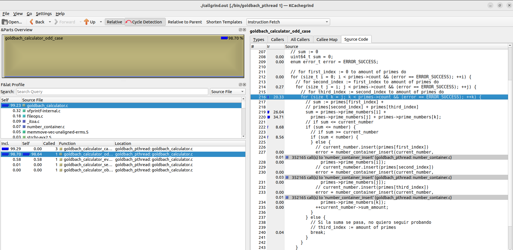
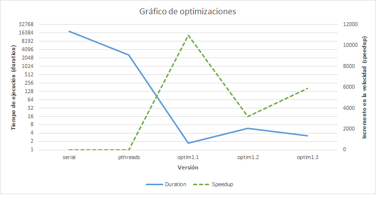
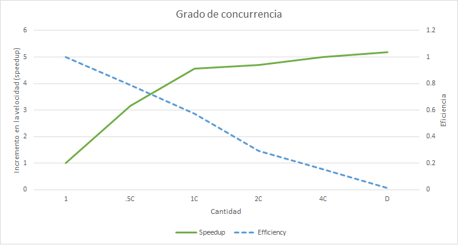
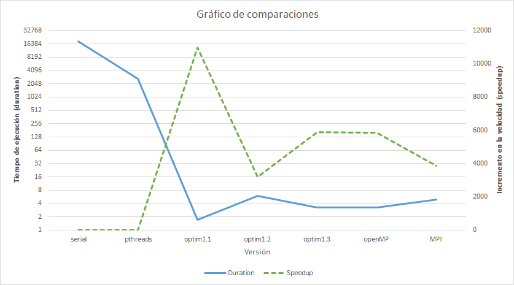

# **Documento de reporte**

El presente documento realiza un reporte de las optimizaciones realizadas a la aplicación de cálculo sumas de Goldbach.

Estas optimizaciones siendo implementadas desde un punto de vista serial y paralelo para mejorar el uso de memoria y tiempo de ejecución.

De igual manera cubre la implementación del programa utilizando la tecnología de OpenMP y MPI (combinado con OpenMP).

## **1. Optimizaciones seriales:**

### **Medición de tiempo de tarea serial:**

Duración: 18963.553415393s

Esto equivale aproximadamente a 5 horas de ejecución. 

### **Profiling:**

Para las optimizaciones seriales se quiere trabajar desde dos puntos, el tiempo de ejecución para realizar el cálculo de sumas y mejorar el uso de la memoria al utilizar la criba. 

Para esto, se presenta una captura del análisis dinámico de rendimiento:

Observando la captura de la herramienta se puede visualizar cómo un 98% del consumo del CPU se encuentra dentro del caso para calcular sumas de números impares.

Para poder optimizar la solución, se debe plantear una nueva mánera de realizar el cálculo evitando la mayor cantidad de ciclos posibles para ambos casos. Aunque no sea tan intenso en consumo, el cálculo de números pares de igual manera debe ser replanteado de una manera que no sea fuerza bruta bajando la cantidad de ciclos.

### **1.1 Optimización de ciclos de cálculo de sumas**

**Propuesta de optimización:**

Para la primera iteración se replantea el cálculo de sumas. Para esto, se cambia el uso de la implementación de la criba de Atkin. Originalmente se utilizaba para guardar todos los primos y utilizarlos para un cálculo de fuerza bruta. Ahora, el arreglo de bools de la criba se va a guardar para consultar si un número es primo en tiempo constante. Para el cálculo de números pares, se recorren los números desde el 3 hasta la mitad del número deseado. Si el número de la iteración es primo, se resta al original y se consulta si es el resultado es primo. En caso de que ambos sean primos componen la suma de Goldbach del número par. Para los números impares se repite el mismo proceso 

**Resultados de optimización:**

Al replantear el cálculo de sumas se obtuvo: 

1. **Duración:** 1.728907226s

2. **Speedup:** 10968.5199588569

3. **Eficiencia:** 1371.06

**Lecciones aprendidas:**

Dos lecciones fueron aprendidas del proceso. Al trabajar con la criba, es más eficiente, para motivos del algoritmo implementado, utilizarla para consultar si un número es primo en vez de utilizarla para guardarla en un conjunto de primos. De igual manera, realizar el cálculo de sumas a fuerza bruta no es una manera eficiente de trabajar. Cuando se trabajan con ciclos, si es posible se debe buscar una versión alternativa que utilice una idea análoga con menor cantidad de ciclos. Al reducir la cantidad de iteraciones la velocidad de la implementación incrementa exponencilamente. 

### **1.2 Optimización de uso de memoria**

**Propuesta de optimización:**

Para la segunda iteración, se plantea optimizar el uso de la memoria. Para guardar la criba se utiliza un arreglo de bools. Se debe notar que cada bool gasta 1 byte entero de memoria. Ese byte solo representa un valor que se puede representar de manera más eficiente con un bit. Por esta razón, para optimizar el uso de memoria, en un byte se plantea utilizar todos los bits para representar valores. Utilizando shifts y máscaras para accesar diversas posiciones del contenedor. Se estima que el tiempo de ejecución va a aumentar debido que, aunque el acceso siga siendo constante, toma más tiempo.

**Resultados de optimización:**

Al implementar el arreglo de bits se obtuvo:

1. **Duración:** 5.896884109s

2. **Speedup:** 3215.85994651824

3. **Eficiencia:** 401.98

**Lecciones aprendidas:**

Al optimizar todo trae un costo entre velocidad y memoria. Aunque el arreglo de bits implica un mejor uso de la memoria aprovechando cada byte, realizar estos cambios relantiza la ejecución. Para poder consultar el bit que contiene la posición con el arreglo de bools se puede obtener en mayor velocidad que con el arreglo de bits. Aunque ambos tiempos son constantes, para el arreglo de bits representa mayores constantes de proporcionalidad. Mucho de este tiempo es perdido preparando la máscara para realizar cada consulta. Se intentó utilizar un AND de bits y un shift para realizar las operaciones de módulo y división de manera más eficiente. De igual manera las operaciones terminaron representando un gran costo.

### **1.3 Optimización de velocidad al uso de memoria**

**Propuesta de optimización:**

Se plantea una tercera iteración debido al incremento de tiempo que la optimización de memoria presentó. Para la tercera iteración, se plantea optimizar la velocidad al consultar el valor de un bool dentro del arreglo de bits. En vez de preparar la máscara cada llamado de una función, se prefiere utilizar un arreglo de máscaras estático. Donde cada posición es análoga al bit que se quiere accesar. Se espera un incremeneto en la velocidad al ejecutar. Para realizar esto se requieren menas operaciones para el CPU ya que se consulta un arreglo en vez de realizar operaciones para preparar la máscara.

**Resultados de optimización:**

1. **Duración:** 3.208158055s

2. **Speedup:** 5911.04088086863

3. **Eficiencia:** 738.88

**Lecciones aprendidas:**

Aunque el arreglo de bits implica un incremento en velocidad, una vez optimizado, representa un beneficio para la ejecución del programa. Reduce 8 veces la cantidad de bytes que se utilizan para guardar la criba. Aunque el uso de la memoria se convierte mucho más eficiente en ambas versiones, al optimizarla se encuentra un buen balance entre optimizaciones de velocidad y memoria.

## **2. Optimización con Pthreads y Mapeo Dinámico:**

**Propuesta de optimización:**

La optimización de pthreads y mapeo dinámico se presentan como una singular debido a que se implementó el modelo desde la segunda tarea. Para realizar el mapeo dinámico se toma la opción de utilizar un mutex para poder accesar el contador de números procesados. Para la ejecución existen los casos de tener menor cantidad de hilos o una cantidad mayor o igual. En el caso de tener menos hilos, se encargan de moverse de unidad de trabajo. En caso de haber mayor cantidad, los innecesarios no son creados del todo y se crea la cantidad exacta sin necesidad de corrimientos.

1. **Duración:** 2662.9487900380000

2. **Speedup:** 7.1212610194890

3. **Eficiencia:** 0.89

**Lecciones aprendidas:**

Debido a que cada cálculo de sumas es independiente al previo, la implementación de paralelismo con mapeo dinámico se presenta como una eficiente. Se podría pensar implementar una versión sin mutex, pero por términos de simplicidad y legibilidad del código para el programador es una implementación funcional.

## **3. Comparaciones de optimizaciones:**

A continuación se presenta el gráfico con las optimizaciones:

En el eje x se presentan las diferentes versiones del programa que se realizaron. 

1. `serial` se refiere a la solución presentada en la primera tarea.

2. `pthreads` se refiere a la solución presentada en la segunda tarea que incluye el mapeo dinámico.

3. `optim1.1` se refiere a la solución para optimizar el cálculo de sumas de Goldbach.

4. `optim1.2` se refiere a la primera implementación del arreglo de bits para optimizar memoria.

5. `optim1.3` se refiere a la versión optimizada en velocidad del arreglo de bits.

Para el eje y se tienen dos casos. En el primero, visto a la izquierda, se presenta un rango para los tiempos de ejecución de cada tarea. En el segundo, visto a la derecha, se presenta un rango del incremento en velocidad o speedup en contraste a la versión serial.

Como se puede observar el mejor tiempo de ejecución, con mayor incremento de velocidad, se encuentra en la optimización 1.1. Esto es debido que, a cambio de versiones posteriores, no sacrifica tiempo por un mejor uso de memoria. El cálculo de sumas para las tres optimizaciones es el mismo, excepto que las versiones 1.2 y 1.3 presentan uso del arreglo de bits para guardar los valores de los primos. Por esta razón, la optimización 1.3, crea un balance entre mejoras de velocidad y memoria. Esto es debido a que presenta un tiempo de ejecución mejorado a la anterior, aunque no comparable a la primera, pero con un mejor uso de memoria que la primera optimización. El mayor incremento de desempeño se presenta por medio de la primera optimización, mientras que el mayor balance se encuentra en la tercera optimización.

## **4. Grado de concurrencia:**

A continuación se presenta el gráfico con el grado de concurrencia:

En el eje x se presentan las diferentes ejecuciones del programa con hilos que se realizaron. 

1. `1` representa un hilo de ejecución.

2. `.5C` representa tantos hilos como la mitad de CPUs que hay en la computadora.

3. `1C` representa tantos hilos como la cantidad de CPUs que hay en la computadora.

4. `2C` representa dos hilos por cada CPU que se encuentre en la computadora.

5. `4C` representa cuatro hilos por cada CPU que se encuentre en la computadora.

5. `D` representa una cantidad equitativa de hilos como la cantidad de inputs realizados

Al comparar el grado de concurrencia se puede notar la relación presentada entre el speedup y la eficiencia de la útltima optimización. Al trabajar con una cantidad de hilos entre la mitad de CPUs y la misma cantidad de CPUs se tiene la mejor distribución de trabajo. En el caso de la máquina utilizada para las pruebas, este rango va entre 4 hilos a 8 hilos. Aunque entre más aumentan los hijos, se presenta un menor tiempo de ejecución que no es favorable. Se considera despreciable ya que en contraste a la velocidad, la eficiencia va decayendo de manera incremental. La cantidad de hilos óptima debe ser un número entre 4 y 8, pero de manera preferible cercano más a 4 que 8 ya que existe una decaída en eficiencia.

## **5. Contraste entre OpenMP y tecnología pthreads**

Al comparar la implementación por medio de tecnología de pthreads con la implementación realizada con OpenMP se nota un comportamiento similar. Es posible que a nivel interno OpenMP utilice la tecnología de pthreads para su ejecución. La verdadera diferencia es en la cantidad de líneas de código requeridas, ya que OpenMP requiere mucho menos. Si se ve la duración, speedup y eficiencia entre ambas implementaciones se nota la similitud.

|            | Pthreads           | OpenMP               |
|------------|--------------------|----------------------|
| Duration   | 3.2081580550000    | 3.239991141000000    |
| Speedup    | 5911.0408808686300 | 5852.964588520460000 |
| Efficiency | 738.88             | 731.62               |

Note que con Pthreads se refiere a la optimización 1.3 del código.

De igual manera, las mediciones se realizaron en el clúster arenal, con el caso input029.txt.

## **6. Contraste entre OpenMP y MPI**

Al comparar la implementación realizada por medio de OpenMP y la implementación que une OpenMP y MPI, se puede observar que se encuentran similar en tiempo de ejecución, pero con MPI tomando alrededor de dos segundos más. Aunque MPI puede distribuir el trabajo de mejor manera, solo un proceso se encarga de recibir todos los mensajes. Implicando que aunque los cálculos se realicen de una manera más distruibuida, su unión implica un costo en términos de tiempo. Los sends y receives terminan saliendo caros para la ejecución.

|            | OpenMP               | MPI                  |
|------------|----------------------|----------------------|
| Duration   | 3.239991141000000    | 4.923783951000000    |
| Speedup    | 5852.964588520460000 | 3851.418665829470000 |
| Efficiency | 731.62               | 481.43               |

De igual manera, las mediciones se realizaron en el clúster arenal, con el caso input029.txt.

## **7. Comparaciones con OpenMP y MPI:**

De igual manera, las mediciones se realizaron en el clúster arenal, con el caso input029.txt. En el eje x se presentan las diferentes versiones del programa que se realizaron: 

1. `serial` se refiere a la solución presentada en la primera tarea.

2. `pthreads` se refiere a la solución presentada en la segunda tarea que incluye el mapeo dinámico.

3. `optim1.1` se refiere a la solución para optimizar el cálculo de sumas de Goldbach.

4. `optim1.2` se refiere a la primera implementación del arreglo de bits para optimizar memoria.

5. `optim1.3` se refiere a la versión optimizada en velocidad del arreglo de bits.

6. `openMP` se refiere a la versión con únicamente openMP

7. `MPI` se refiere a la versión implementada con la unión entre openMP y MPI

Para el eje y se tienen dos casos. En el primero, visto a la izquierda, se presenta un rango para los tiempos de ejecución de cada tarea. En el segundo, visto a la derecha, se presenta un rango del incremento en velocidad o speedup en contraste a la versión serial.

Se puede observar que openMP se comporta de manera más similar a la optimización 1.3, pero la pérdia con MPI no es significativa. Aunque la versión con MPI divide el trabajo más y permite cubrir más secciones de manera simultánea, debe comunicarse con el proceso 0 para reportar sus resultados. La ejecución no terminará hasta que el proceso 0 termine de consumir los datos que se le envían. Por medio de estos sends y receives se puede empeorar la ejecución en contrarste a la optimización1.3 y la versión openMP. 

## **8. Tabla completa:**

|            |        Serial       |      Pthreads      |       optim1.1      |      optim1.2      |      optim1.3      | OpenMP               | MPI                  |
|------------|-------------------|-------------------|---------------------|--------------------|--------------------|----------------------|----------------------|
| Duration   | 18963.5534153930000 | 2662.9487900380000 | 1.7289072260000     | 5.8968841090000    | 3.2081580550000    | 3.239991141000000    | 4.923783951000000    |
| Speedup    | 1.00                | 7.1212610194890    | 10968.5199588569000 | 3215.8599465182400 | 5911.0408808686300 | 5852.964588520460000 | 3851.418665829470000 |
| Efficiency | 1.00                | 0.89               | 1371.06             | 401.98             | 738.88             | 731.62               | 481.43               |