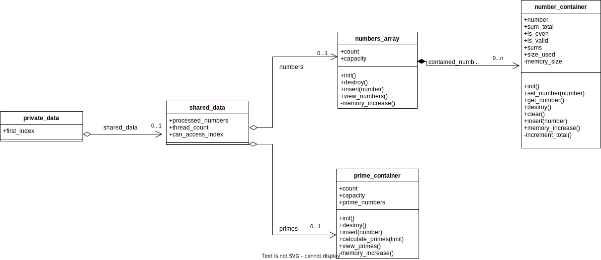
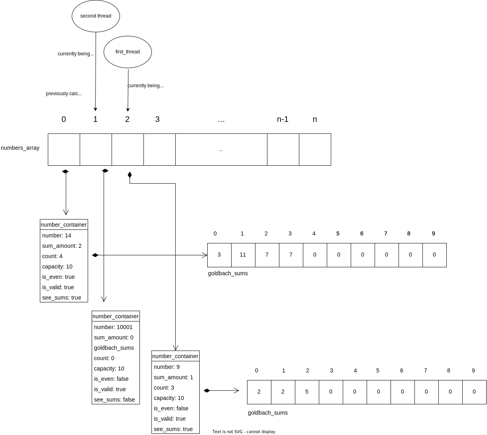

## **Diagrama de estructuras:**

Aquí se presenta un diagrama que representa las estructuras presentadas en el código. Primero se tiene el private_data de cada thread. Aquí se debe entender que este diagrama de estructuras aplica para cada thread que se cree. Luego en el rastreo de memoria se podrá evidenciar cómo se aplica.

El private_data contiene dos variables, first_index representa la primera posición del numbers_array que le corresponde procesar. En caso de que el thread requiera procesar más de una posición del array, se actualizará. Cada private_data es único a cada thread. De igual manera contiene un puntero al shared_data a la que todo thread tiene acceso.

El shared_data maneja 5 variables. processed_numbers representa la cantidad de números que han sido procesados y la posición que se quiere procesar. Para que un hilo sepa a dónde ocupa trabajar en el numbers_array después del cálculo inicial, le suma uno a processed_numbers y lo toma como su nuevo index. Para poder accesar esta variable sin causar condición de carrera se tiene el mutex can_access_index. De igual manera posee el thread_count. Dentro de shared_data por medio de numbers se tiene acceso al numbers_array y por medio de primes se tiene acceso a primes_container.

Note que el private_data no se encarga de borrar el shared_data, solo tiene un puntero al struct. De igual manera shared_data no se encarga de eliminar numbers_array o prime_container, solo tiene acceso a ambos.

Se tiene numbers_array, que contiene un count, capacity y un number_container.

El numbers_array es un array dinámico de tipo number_container. Para el manejo de este, el count lleva la cuenta de cuántos elementos han sido insertados. La variable capacity mantiene el largo del array a nivel de memoria, una vez que el count sea igual al capacity, se incrementa la memoria, se copian los datos y se libera la memoria original por una nueva.

Dentro de cada number_container se tiene un number que contiene el número, de manera positiva. La variable sum_total lleva la cuenta de cuántas sumas de goldbach han sido encontradas para el respectivo número. De igual manera, tiene bools para indicar si es válido y si es par. Un número no válido va de -5 a 5.

Finalmente repite las características del numbers_array para manejo de memoria dinámica. Esta memoria se utiliza para sums, que guarda las sumas de goldbach encontradas. Esto se podrá ver mejor en el rastreo de memoria.

Luego por separado, se tiene un prime_container, implementado de manera similar a numbers_array para manejar los números primos encontrados. La diferencia es que en vez de contener structs de number_container, contiene números directamente.

## **Rastreo de memoria:**

Aquí se puede visualizar, con el rastreo de memoria, cómo se manejan los threads con respecto al resto de estructuras y cómo el numbers_array contiene varios number_container y cada number_container tiene los respectivos datos del números. Esto incluye su cantidad de sumas, sus sumas, su validez y paridad.

Para este se presenta rastreo de memoria se presenta el caso donde hay menor cantidad de threads a números por ser procesados.

Note que la posición 0 del numbers_array contiene un number_container con un 14 al cuál se le quiere ver las sumas. Estas ya fueron calculadas por el primer thread y se encuentran dentro del goldbach_sums respectivo al number_container. Las dos sumas del 14 son:

    3 + 11
    
    7 + 7

Cuando el primer thread terminó de ejecutar el 14, utilizó y aumentó processed_numbers para ver que la siguiente posición que le corresponde es la 2 del numbers_array. Aquí se encuentra un 9, que tiene dos sumas de Goldbach. Para representar que el hilo no ha terminado su ejecución, se representa como si solo ha encontrado una para ese momento.

Las sumas del 9 son: 

    2 + 2 + 5 y 3 + 3 + 3

Pero el thread solo ha encontrado: 

    2 + 2 + 5 
    
hasta el momento 

En el caso del segundo thread, este se encuentra procesando 1001 y no le ha encontrado ninguna suma hasta el momento, una vez que termine de encontrar las sumas de 1001, el thread va a consultar processed_numbers desde el shared_data, se va a aumentar y se va a colocar en la siguiente posición de numbers_array para procesarlo.

Este proceso se repite entre los threads hasta que se hayan reservado todos los números de numbers_array por un thread. Cuando se reservan todas las posiciones, los threads que terminan sus cálculos se salen de los ciclos y son liberados.

