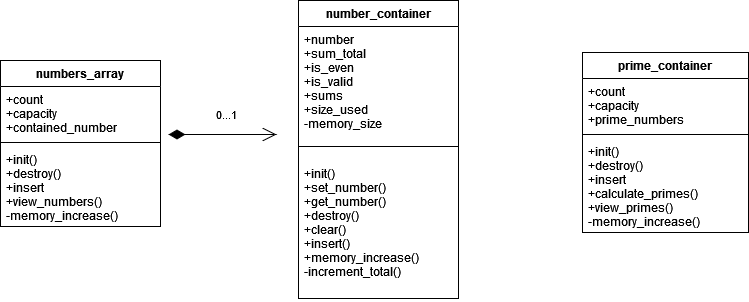
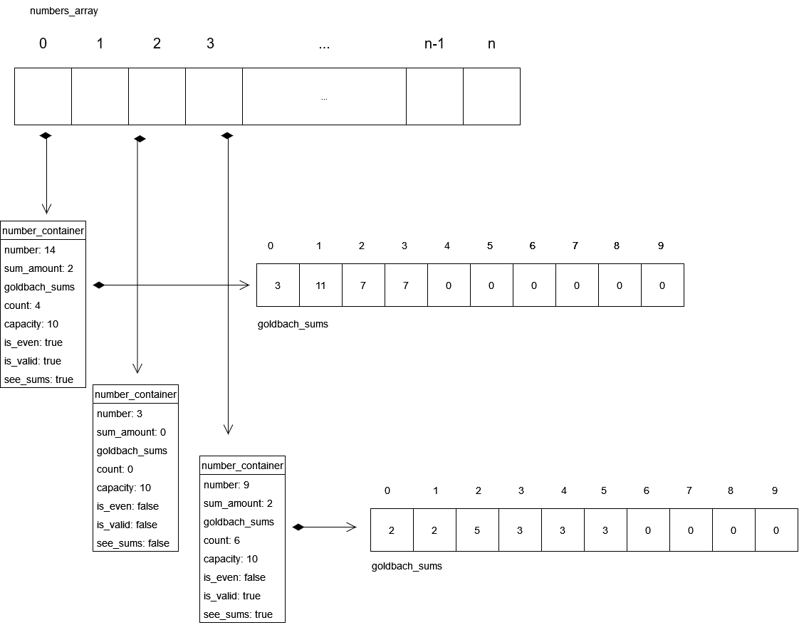

## **Diagrama de estructuras:**

Aquí se presenta un diagrama que representa las estructuras presentadas en el código. Primero se tiene numbers_array, que contiene un count, capacity y un number_container.

El number_container es un array dinámico de tipo number_container. Para el manejo de este, el count lleva la cuenta de cuántos elementos han sido insertados. La variable capacity mantiene el largo del array a nivel de memoria, una vez que el count sea igual al capacity, se incrementa la memoria, se copian los datos y se libera la memoria original por una nueva.

Dentro de cada number_container se tiene un number que contiene el número, de manera positiva. La variable sum_total lleva la cuenta de cuántas sumas de goldbach han sido encontradas. De igual manera, tiene bools para indicar si es válido y si es par.

Un número no válido va de -5 a 5. Finalmente repite las características del numbers_array para manejo de memoria dinámica. Esta memoria se utiliza para sums, que guarda las sumas de goldbach encontradas. Esto se podrá ver mejor en el rastreo de memoria.

Luego por separado, se tiene un prime_container, implementado de manera similar a numbers_array para manejar los números primos encontrados. La diferencia es que en vez de contener structs de number_container, contiene números directamente.

## **Rastreo de memoria:**

Aquí se puede visualizar, con el rastreo de memoria, cómo el numbers_array contiene varios number_container y cada number_container tiene los respectivos datos del números. Esto incluye su cantidad de sumas, sus sumas, su validez y paridad.

**Se presentan los tres casos posibles:**

1. Un número par: El 14 tiene dos sumas

    3 + 11

    7 + 7

Tiene activado el campo de is_even por ser un número par y de igual manera el campo de is_valid ya que no se encuentra en el rango de -5 a 5. Finalmente posee see_sums como true, entonces al final del programa se mostrará como negativo junto a sus sumas.

2. Un número impar: El 9 de igual manera posee dos sumas

    2 + 2 + 5

    3 + 3 + 3

A cambio del número par, no tiene el campo de is_even activado por ser impar. Se encuentra como valid ya que no está en el rango de -5 a 5. Finalmente, posee see_sums como positivo entonces al final del programa también se mostrará como negativo junto a sus sumas.

3. Un número no válido: El 3 se presenta como un número no válido, por ir de -5 a 5. 

Por esto tiene el flag de is_valid como false. El see_sums no afecta ya que imprimirá NA junto al número. Note que, aunque no se ve, contiene un goldbach_sums inicializado en 0 en todos sus valores.

Finalmente se debe notar como todos los otros campos de numbers_array tienen contenido implícito, pero no se aclara para mantener la simplicidad del rastreo de memoria.

